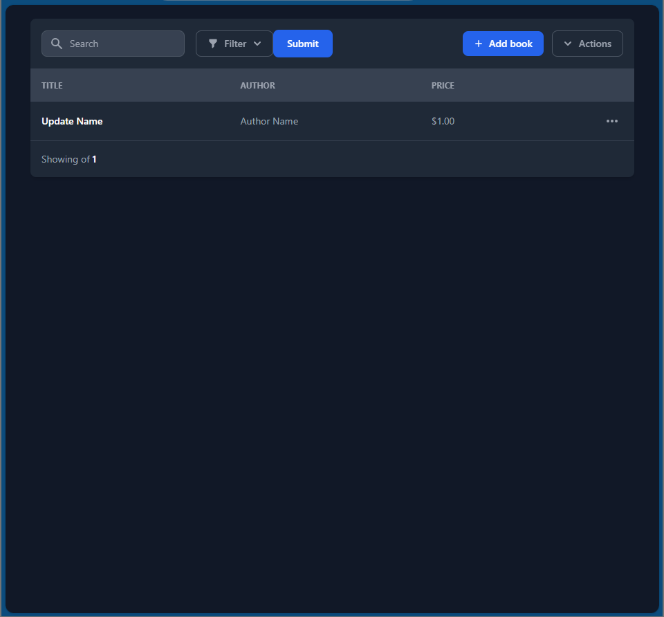
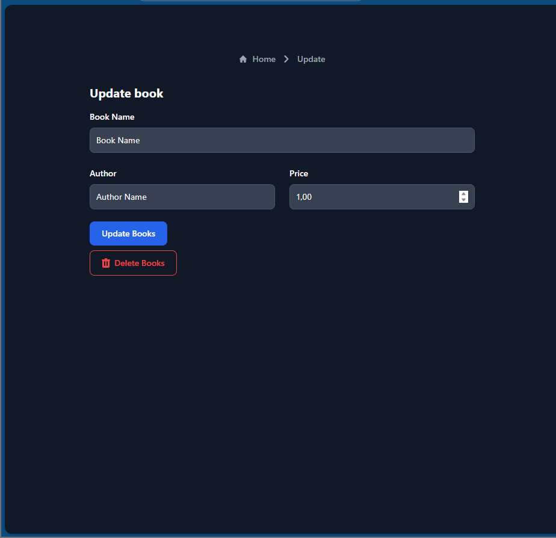
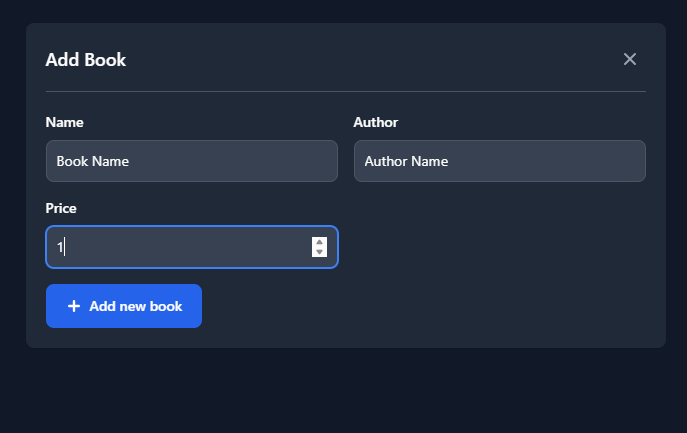
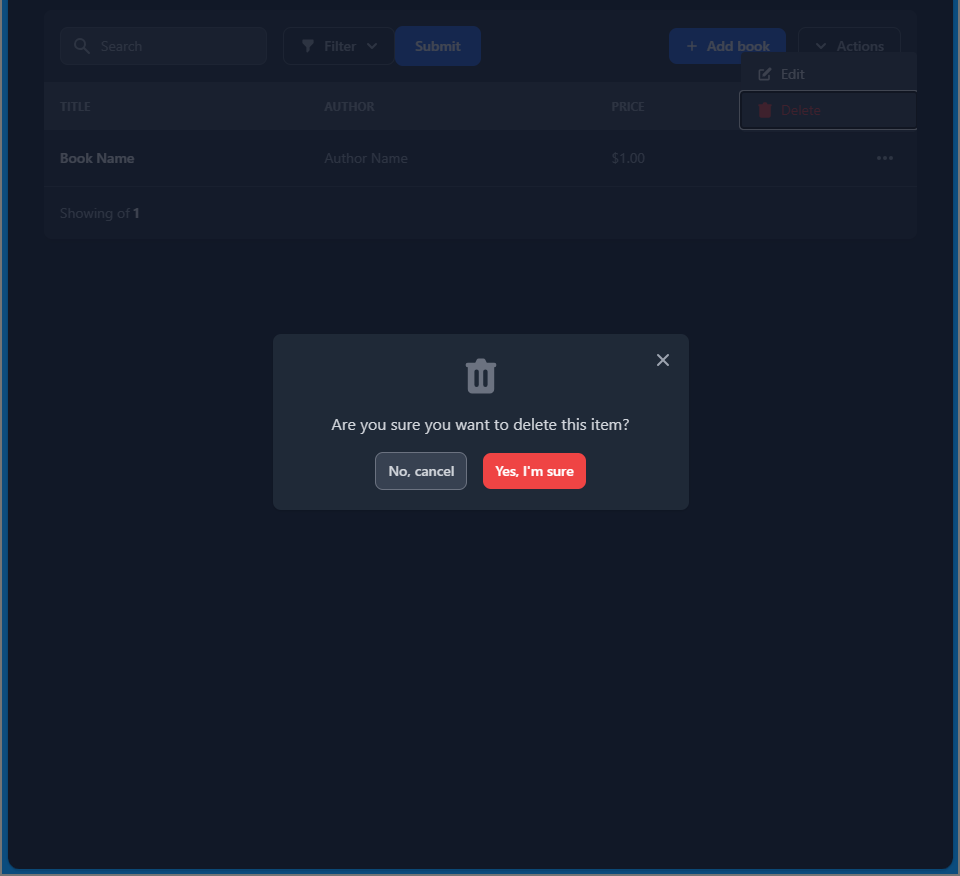
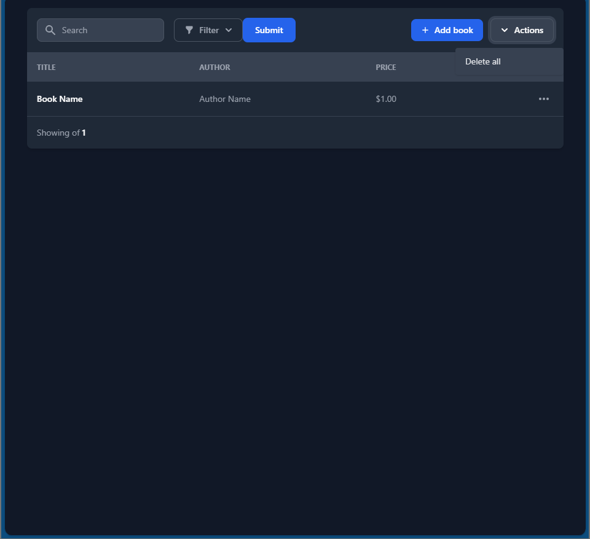
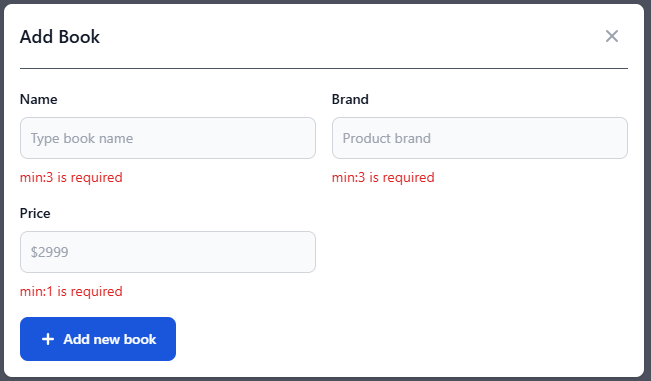

# Simple Bookstore
In this project you are required to develop a CRUD application using PDO and mySQL. 
## Goals
The skills you will learn from this project include:

- Schema design and databse
- Restful API design
- CRUD operations with PDO
- Error handling
- form validation
- Frontend rendering

## Requirements
You are required to implement the following features.
- CRUD Book store operations
- Implementation of CRUD operations with PDO
- Implementation counting length of book
- Implementation of error handling and form validation
- Use a database to store the Book Store data (for begginer choose MySQL)
- Implementation of Frontend rendering with PHP
### CRUD Book store operations
Get the book store data
```json 
GET /api/v1/book
[{
    "title": "Jhon Doe",
    "author": "Jhon Doe",
    "price": 100
}]
```

Get the book store by ID
```json 
GET /api/v1/book/1
[{
    "title": "Jhon Doe",
    "author": "Jhon Doe",
    "price": 100
}]
```

Post the book store data
```json 
POST /api/v1/book
{
    "title": "Jhon Doe",
    "author": "Jhon Doe",
    "price": 100
}
```

Delete the book store data by ID
```json 
POST /api/v1/book/delete/1
{
    "title": "Jhon Doe",
    "author": "Jhon Doe",
    "price": 100
}
```

Delete the all book store data
```json 
POST /api/v1/book/delete
{
    "title": "Jhon Doe",
    "author": "Jhon Doe",
    "price": 100
}
```

Update the book store data base by ID
```json 
POST /api/v1/book/update/1
{
    "title": "Jhon Doe",
    "author": "Jhon Doe",
    "price": 100
}
```

### Error-Handling and Form-validation
Validating Users Input
```json 
POST /api/v1/book
{
    "errors": {
        "title": "min:3 is required",
        "author": "min:3 is required",
        "price": "min:1 is required"
    }   
  }
}
```

### Bonus
- Implementation sorting low or high price for the books
- Implementation search for the title of books
This project will help you understand how to implement REST API, CRUD operations and Frontend Rendering with PHP using OOP and PDO. 

Note: In the HTML Form action, you can use the `action` attribute to specify the URL to which the form data will be sent and the type of request to be made must be `POST` or `GET`.